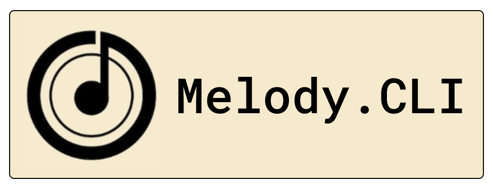

# _Melody.CLI - A next-generation music streaming experience in your terminal (Upcoming Project)_



### _Project Overview_
_Welcome to Melody CLI, a versatile command-line music player that brings the power of YouTube to your terminal. Whether you're a developer looking to integrate music playback into your own applications or a music enthusiast who enjoys the simplicity of command-line tools, Melody CLI has you covered._

_With Melody CLI, you can easily search for songs on YouTube Music, download the audio, and play it directly from your terminal. The tool leverages the robust capabilities of yt-dlp for downloading and converting YouTube videos, ytmusicapi for interfacing with YouTube Music, and pygame for seamless audio playback._

_Our straightforward command-line interface ensures that navigating through the CLI is a breeze, making it accessible even to those who are new to command-line tools. Whether you're pausing, resuming, or stopping playback, Melody CLI provides intuitive controls to manage your listening experience._

_Join us in exploring the world of music through the command line. Melody CLI is open-source and welcomes contributions from the community, so feel free to get involved and help us improve this tool._

### _Why Melody.CLI ?_
_In a world dominated by graphical user interfaces, Melody.CLI offers a refreshing alternative. Designed for music enthusiasts who appreciate the elegance and efficiency of the command line, Melody.CLI provides a distraction-free, immersive music experience. Whether you're a developer seeking seamless music playback while coding, or a terminal aficionado, Melody.CLI is crafted to meet your needs._

### _Exciting Features to Look Forward To_

- _**Search Songs**: Find songs by title or artist using the YouTube Music API._
- _**Download Audio**: Download audio from YouTube videos and convert them to MP3._
- _**Play Music**: Play downloaded songs directly from the command line._
- _**Playback Controls**: Pause, resume, and stop playback using intuitive commands._

### _Installation_

_You can install Melody.CLI from PyPI:_

```sh
pip install melody_cli
```


### _Run Locally_

_Clone the project_

```bash
  git clone https://github.com/pythonicforge/melody.CLI
```

_Go to the project directory_

```bash
  cd melody.CLI
```

_Create a virtual environment_

```bash
  pip install virtualenv
```
```bash
  virtualenv env
```

_Install dependencies_

```bash
  pip -r "requirements.txt"
```

### _Usage/Examples_

```python
from src.Melody_CLI import Player

if __name__ == '__main__':
    player = Player()
    searchQuery = input("Search for a song: ")
    youtubeSearchResults, videoIDS = player.searchSong(searchQuery)
    desiredVideo = int(input("Enter desired video number: "))
    audioFile = player.downloadSong(videoIDS[desiredVideo])
    player.playSong(audioFile)

```


### _Technical Highlights_

- _**YTMusicAPI:** Fetch songs and get search recommendations_
- _**Yt_DLP:** Download YT songs and store them locally._
- _**Pygame:** Playback and control the downloaded audio files._


### _Contributing_

_Contributions are always welcome!_
_See `contributing.md` for ways to get started._
_Please adhere to this project's `code of conduct`._

_Stay tuned for Melody.CLI, an upcoming project that will redefine music streaming for the terminal generation. Melody.CLI is a testament to my skills in Python development, user-centric design, and my passion for creating innovative, real-world applications. Join me on this journey to bring a unique music streaming experience to life._
